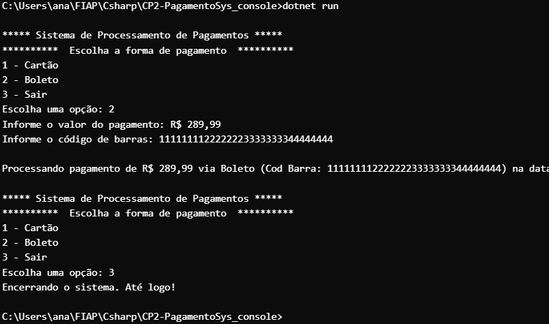

# Sistema de Processamento de Pagamentos - CP2

##  Integrantes
- Ana Clara Melo (559021)
- David Murilo de Oliveira Soares (559078)
- Lucas Serrano (555170)
- Yasmin Gonçalves Coelho (559147)

---

## Descrição

Aplicação console em **C#** que simula um sistema de pagamentos. O sistema permite ao usuário escolher entre **Pagamento com Cartão** ou **Pagamento com Boleto**, coleta os dados necessários, processa a operação via camada de serviço e exibe um resumo da transação.

## Arquitetura

```
CP2-PagamentoSys_console/
├── CP2-PagamentoSys_console.sln
├── CP2-PagamentoSys_console.csproj
├── Program.cs
├── ComponentesUI/
│   └── MenuConsole.cs
├── Interfaces/
│   ├── IPagamento.cs
│   ├── IPagamentoRepository.cs
│   └── IProcessaPagamentoService.cs
├── Models/
│   ├── PagamentoBase.cs
│   ├── PagamentoCartao.cs
│   ├── PagamentoBoleto.cs
│   └── PagamentoDtoIn.cs
├── Repositories/
│   └── PagamentoRepository.cs
└── Services/
    └── ProcessarPagamentoService.cs
```


## Prints

### Pagamento com Cartão e Boleto



